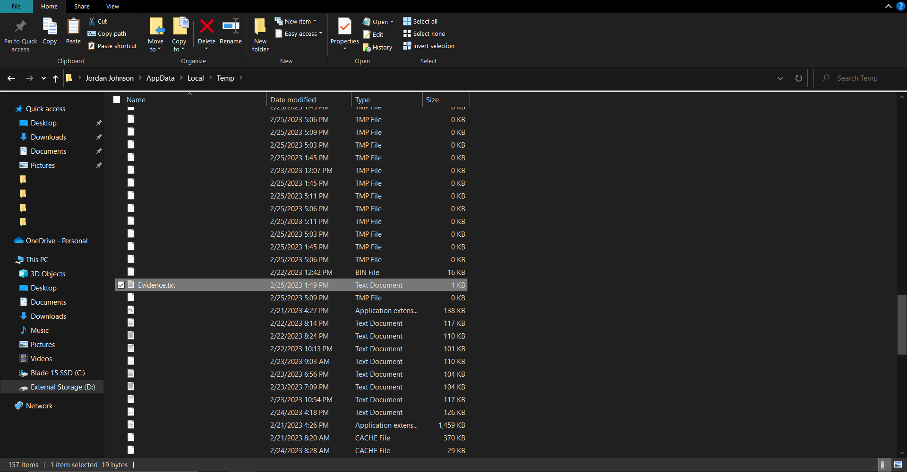
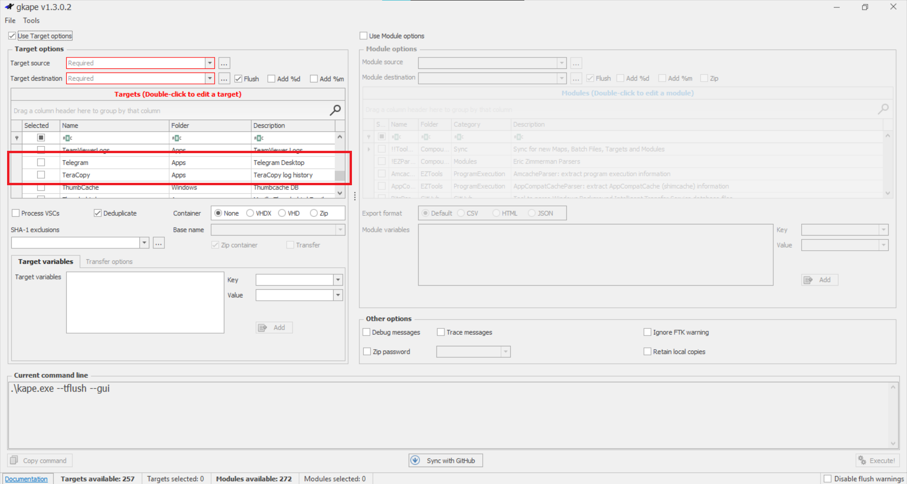
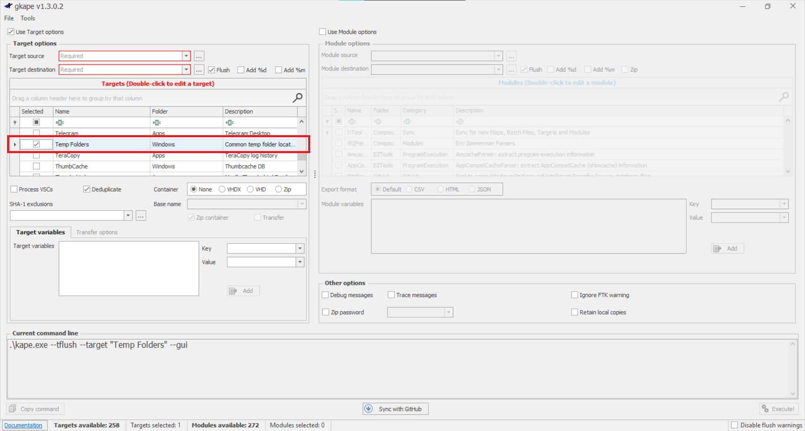
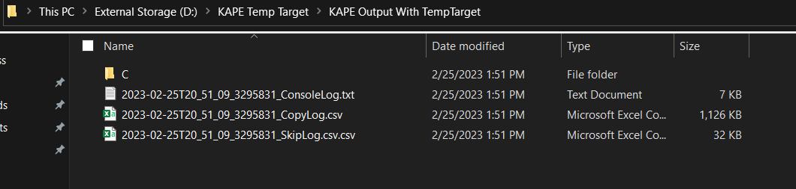

# Proof of Value

## KAPE Temporary Folder Target

The KAPE target included with this repo will look at 3 different locations for temporary folders. Explanations on each folder can be found in the README on the top level. To demonstrate the effectiveness of the target, a file called "Evidence.txt" was placed in a user profile temp folder. If the KAPE target works as expected, it should recreate the folder structure and copy all the files in each temporary folder.

Note that the following screenshots have all other files blocked out of the image.

---

## Proof of Need

To demonstrate that KAPE does not currently have a target dedicated to temp folders, `grep` is run on the cloned KAPE repository searching for `C:\Windows\Temp`. The only two targets that pull this folder are dedicated to specific applications and do not pull all of the files in the temp folder - only very specific ones.

---

## Proof of Value Demo

First, `Evidence.txt` is placed in `C:\Users\<userprofile>\AppData\Local\Temp`.

Next, GKAPE is opened. Without the target, there is no "Temp Folder" target.

After placing the `Temp Folders.tkape` target in the KAPE Targets directory, GKAPE now shows a "Temp Folder" target.

After running KAPE with the Temp Folder target enabled, we can see that it has recreated the directory structure, starting at the C drive.

Navigating to the user's local temp folder, the `Evidence.txt` file was successfully copied over.

---

This demo shows that KAPE can now extract any files within one of the Windows temp folders. The other two folders work the same way and output each file to its respective folder (i.e. a file in `C:\Windows\Temp` will stay in the recreated `C\Windows\Temp` directory in the KAPE output rather than being combined with the user profile temp folder).