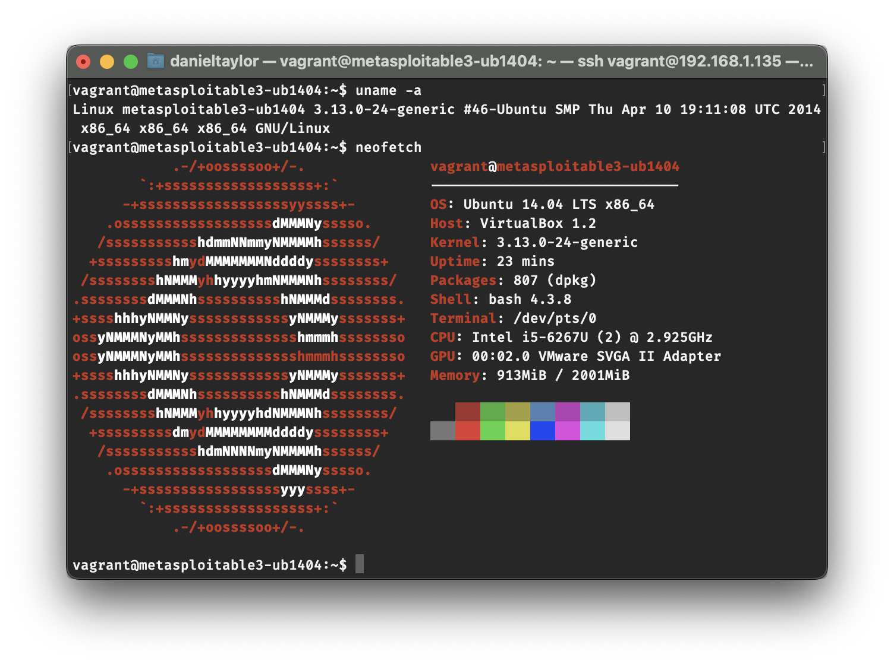

# Proof of Value
*Meterpreter Snort Rule*

This test case will include a target and an attacker machine. The target machine will have our Meterpreter Snort Rule code stored and running on it, where the attacker machine will run Meterpreter to attack the target machine. In this scenario, it will show what the target machine will see before our Meterpreter Snort Rule is implemented and what the target machine will see when it is implemented.

---

The following image will show the process of the Meterpreter configuration for the target machine (IP and Port).

Displaying the target machine information.

Running the exploit on the attacker machine.

Showing the results on the target machine **before** the exploit was ran on the attacker machine.

Showing the results on the target machine **after** the exploit was ran on the attacker machine. Notice the message being sent "Meterpeter session detected".

---

This test case provides a proof of value that our Meterpeter Snort Rule will notify the user when there is a detection of a Meterpeter session. We decided to just alert the user and not terminate the session as to not interupt daily work flow. This can be modified depending on the use case. More documentation can be located [here](Documentation.md).
