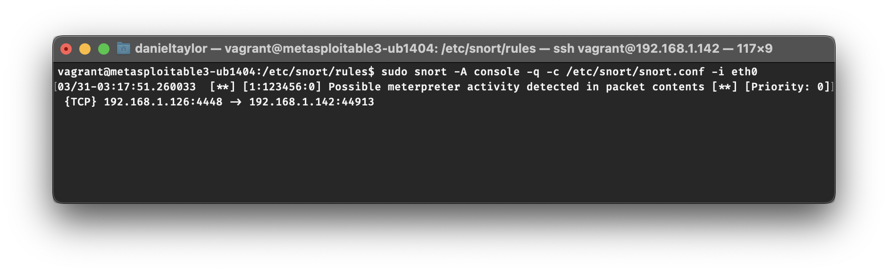
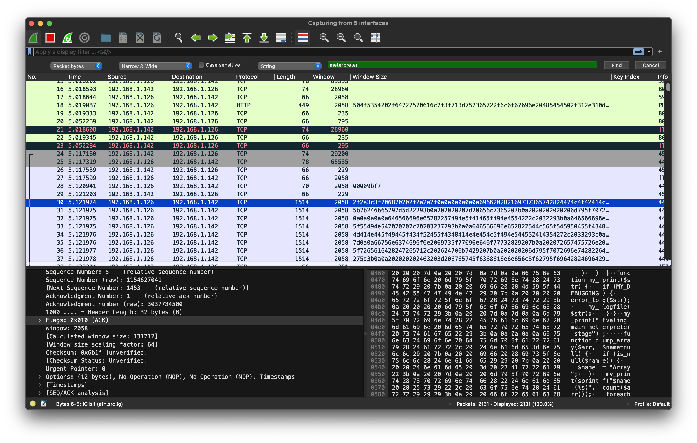
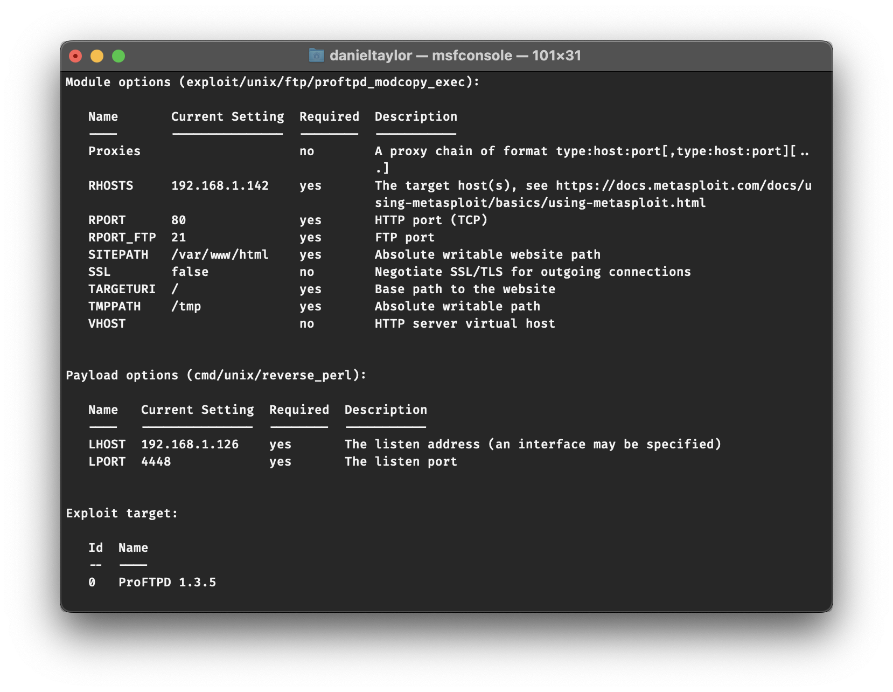
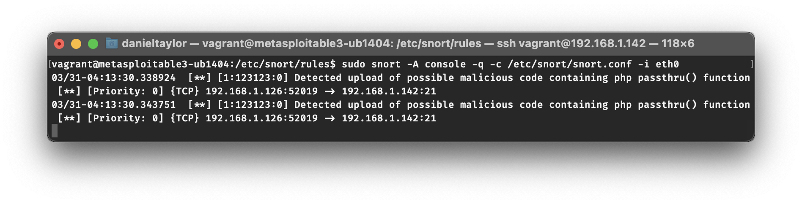
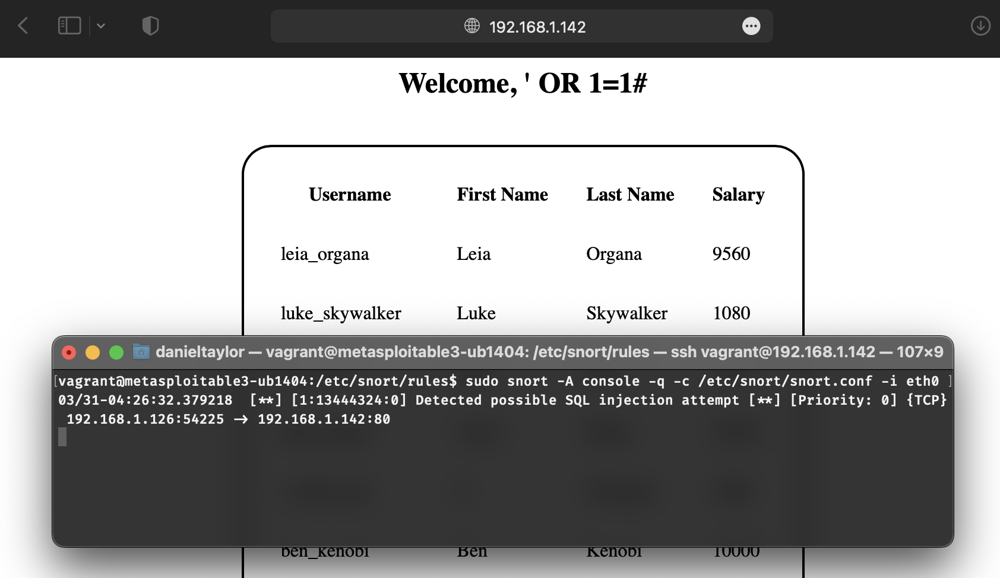

# Proof of Value
*Meterpreter Snort Rule*

This test case will include a target and an attacker machine. The target machine will have our Meterpreter Snort rule code stored and running on it, where the attacker machine will run Meterpreter to attack the target machine. In this scenario, it will show what the target machine will see before our Meterpreter Snort rule is implemented and what the target machine will see after it is implemented.

---

Text about image 1

Text about image 2

Text about image 3

Text about image 4

Text about image 5

---

This test case provides a proof of value that our Meterpeter Snort rule will notify the user when there is a detection of potential Meterpeter activity. We decided to just alert the user and not terminate the session as to not interupt daily work flow. This can be modified depending on the use case. More documentation can be located [here](Documentation.md).
